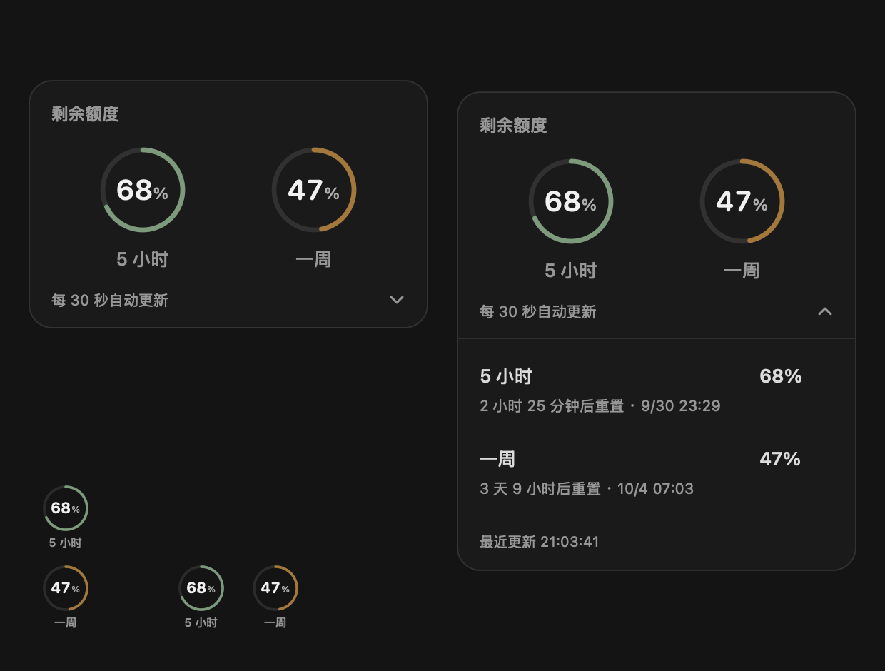

# Codex Quota Rings

**English** · [简体中文](README.zh-CN.md)

A small, native macOS widget that turns your remaining Codex quota into two easy-to-read rings—one for the **5-hour window**, one for the **weekly window**.

Keep a compact pair of rings beside your work, or use an expandable desktop-style card to see reset countdowns and update times. Built with Swift and AppKit, with no web runtime or third-party app dependencies.



## Features

- **Three layouts:** a large horizontal card, compact vertical rings, or compact horizontal rings.
- **Click for details:** expand the large card in place, or open a detail panel from a compact widget. No manual refresh button.
- **Three visibility modes:** follow Codex focus (default), always show, or show on a clear Finder desktop.
- **Automatic updates:** read limits every 30 seconds and receive available app-server quota notifications.
- **A soft palette:** sage green above 50%, warm gold at 20–50%, and terracotta below 20%. Disconnected or stale data turns gray.
- **Persistent settings:** size, orientation, visibility, and each layout’s position are saved independently.
- **Native interaction:** drag to move; right-click the widget or use the menu bar ring to change settings. The widget does not take focus from your current app.

## Requirements

- macOS 12 or later on Apple Silicon or Intel.
- Xcode Command Line Tools (`xcode-select --install`).
- A locally installed and authenticated Codex CLI supporting `codex app-server --listen stdio://` and account rate-limit queries.
- Python 3 for the local protocol test fixture. Automated tests do not require an account or network access.

## Build and run

```sh
git clone https://github.com/innoerL/codex_quota_rings.git
cd codex_quota_rings
make build
open 'build/Quota Rings.app'
```

`make build` runs the test suite, builds for your current architecture, and applies an ad-hoc local signature. `make run` also opens the resulting app. Native window tests require a logged-in macOS graphical session.

The app has a menu bar icon and no Dock icon. Quit from the menu bar ring or the widget’s context menu. This source release does not include a notarized installer or automatic updates.

### Choosing a Codex executable

The app searches `/usr/local/bin/codex`, `/opt/homebrew/bin/codex`, then `/Applications/Codex.app/Contents/Resources/codex`. To use another location, launch the executable directly:

```sh
QUOTA_CODEX_PATH="$(command -v codex)" 'build/Quota Rings.app/Contents/MacOS/QuotaRings'
```

Quota belongs to the account used by that CLI. If the desktop app and CLI use different accounts or configuration homes, their displayed limits may differ.

## Visibility and controls

The current interface is in Simplified Chinese:

| Menu choice | Behavior |
| --- | --- |
| 大 / 小 | Large / small size |
| 小组件布局 → 竖向 / 横向 | Compact vertical / horizontal layout |
| 聚焦 Codex 时显示 | Show while Codex is foreground with a visible window; default |
| 一直显示 | Float above other applications |
| 聚焦桌面时显示 | Show when Finder is foreground and no ordinary app windows remain visible |

Finder folder windows do not count as the desktop. Desktop mode hides conservatively if other application windows remain visible, including on another display, or if desktop state is uncertain. It is a floating AppKit app inspired by desktop widgets, not a WidgetKit extension in the system widget gallery. Stage Manager and multi-display behavior need broader compatibility testing.

## Development

```sh
make test        # Deterministic model, protocol, settings, menu, rendering and window checks
make live-check  # Optional: two read-only queries against your authenticated local account
make clean       # Remove generated build/ files only
```

Synthetic previews are written to `build/`. Live checks are excluded from CI, and live-account captures must never be committed. See [CONTRIBUTING.md](CONTRIBUTING.md) for the development workflow.

## Privacy

The widget communicates with the local Codex CLI over stdio to initialize an app-server session, read rate limits, and receive related notifications. It does not start model turns, modify account limits, inspect credential files, record raw responses, or retain usage history. Only display settings and positions are persisted in macOS UserDefaults.

The widget itself makes no remote network requests. The Codex CLI can use its existing authentication and network connection to retrieve limits; its behavior depends on your installed version and configuration.

## Troubleshooting

- **Widget is hidden:** the default mode follows Codex focus. Select “一直显示” from the menu bar ring to show it everywhere.
- **CLI not found:** supply `QUOTA_CODEX_PATH` using the direct launch command above.
- **Gray rings or no data:** check that the CLI is signed in and your account exposes both quota windows. The widget retries automatically; data older than 90 seconds is marked stale.
- **Version compatibility:** app-server interfaces and desktop app identifiers may change. Not every Codex version or account type is guaranteed to expose compatible limits.

## Help make it better

[Open an issue](https://github.com/innoerL/codex_quota_rings/issues) with a reproducible bug or an idea, or submit a pull request. UI polish, desktop compatibility, accessibility, and translations are welcome. Please use synthetic values in shared screenshots.

## License

[MIT](LICENSE) © 2026 Codex Quota Rings contributors.

This is an independent community project, not affiliated with or endorsed by OpenAI.
